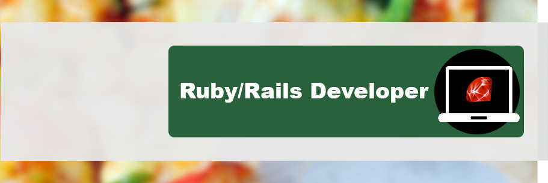



	

I am `Richardson Dackam` a `Ruby on Rails Developer` and the co-founder of a few baby startups [Treepoll](http://www.railsview.com); the first micropolling social network, [HelpMeDateYou](http://www.helpmedateyou.com); a place where girls and guys can share advice, [Railsview](http://www.railsview.com); a ruby on rails theme marketplace,[Railscircle](http://www.railcircle.com); Canada Ruby on Rails Job Board.

I create, build, innovate and I love what I do. I provide a variety of services such as consultation, design work, branding and web development. 

I love to code and among the languages, technologiestools I often play with are: 
<em style="color: white"> 
	HTML5 - CSS3 - Javascript - Jquery 
	Rubymotion - Iphone Development 
	node.js 
	Adaptive Images - Responsive Design - Sprite 
	SCSS - HAML - LESS 
	CSS Animations 
	Git 
	Adobe Photoshop CS6...
</em>  of course :) 

Did I mention that I love web design? Check out my porfolio on [Dribbble](http://www.dribbble.com/richardsondx), and [follow me on twitter](http://twitter.com/richardsondx)

## 1. Why you should follow this blog

I like to share anything that is often not clear enough to understand right away or usefull tools and tricks that I often use.  My blog is also a cool way to show off my work and skills and especially get feedback from the community in order to improve my code. I'm passionate about what I do so I want to give back. `_posts/core-samples` folder.

## 2. How you should read this blog

This blog is pretty straight foward. When you see something like this...

    $ Sometime I'll write terminal commands or ruby code

It's mean that it's a code block. I'm going to share some of my favorite snipeets here so pay a close attention to this.

## 3. Start Reading...

<ul class="posts">
  
    <li>{{ post.date | date_to_string }} &raquo; <a href="{{ BASE_PATH }}{{ post.url }}">{{ post.title }}</a></li>
  
</ul>